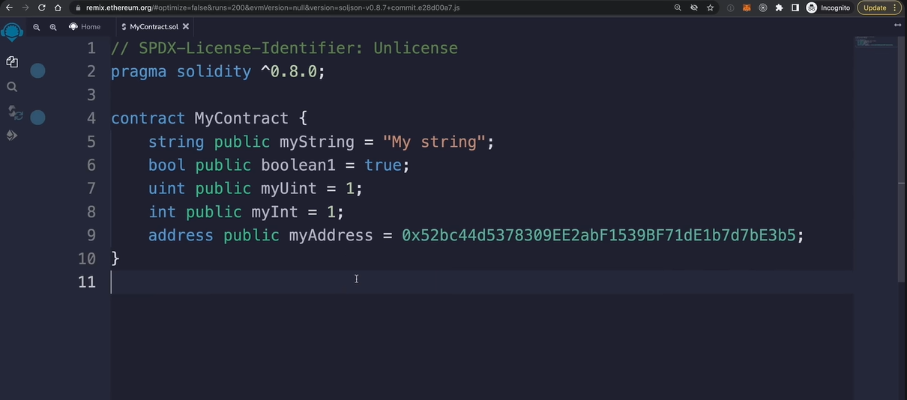
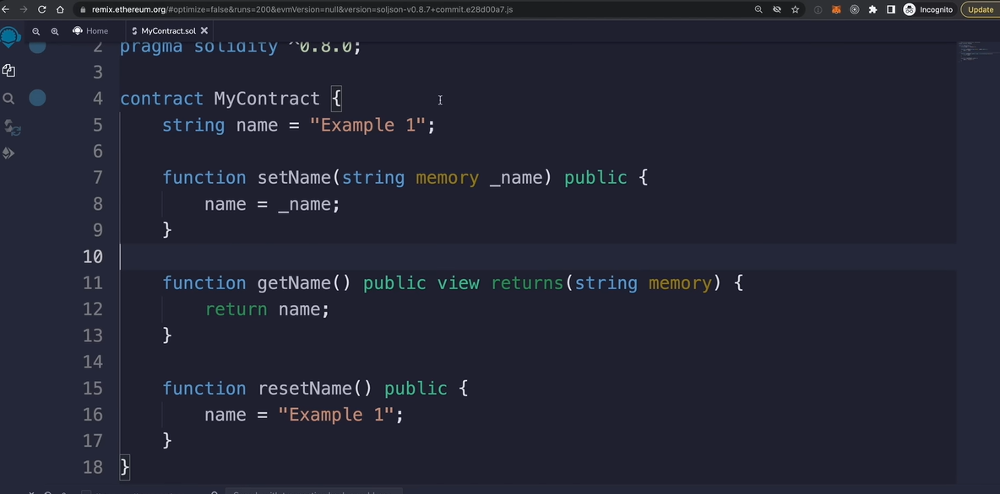
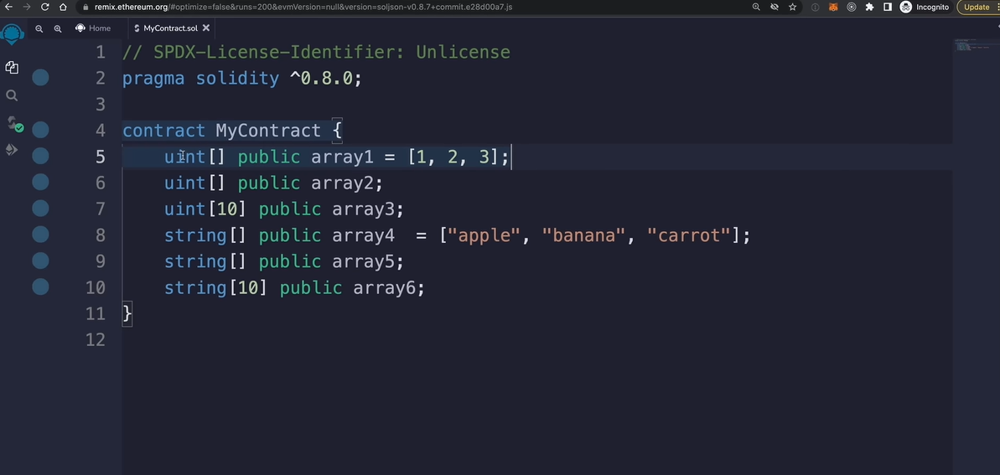

Below are **production-grade technical notes** derived from the transcript you provided.
I am strictly following **all rules** you defined: full English, deep explanations, zero assumptions, textbook-level clarity, and beginner-first teaching.

---

# Module 1: Introduction to Blockchain & Smart Contracts

## 1.1 What Is Solidity?

**Solidity** is a **high-level, object-oriented programming language** specifically designed to write **smart contracts** that run on the **Ethereum blockchain**.

Let’s break this down carefully:

* **High-level language**
  This means Solidity is written in a human-readable form, similar to languages like JavaScript, Python, or Java. You do not write low-level machine instructions.

* **Object-oriented**
  Solidity supports concepts like:

  * Contracts (similar to classes)
  * State (stored data)
  * Functions (behavior)
  * Inheritance (reusing code)

* **Purpose-built for blockchain**
  Solidity is not a general-purpose language like Python.
  It exists specifically to define **rules, logic, and behavior** that live permanently on the blockchain.

---

## 1.2 What Is a Smart Contract?

A **smart contract** is a **self-executing program** stored on the blockchain that:

* Runs exactly as written
* Cannot be changed once deployed
* Does not require a middleman
* Automatically enforces rules and agreements

### Why are they called “smart contracts”?

They represent **digital agreements** where:

* Conditions are written in code
* Execution is automatic
* Trust comes from mathematics and cryptography, not humans

⚠️ Important:

> Once a smart contract is deployed to the blockchain, **its code is immutable**, meaning it **cannot be modified**.
> This immutability is a **feature**, not a limitation.

---

## 1.3 Web2 vs Web3 Architecture

### Traditional Web2 Application

In a typical Web2 system:

* A **browser** communicates with:
* A **centralized server**
* That server interacts with:
* A **database**

Example backend technologies:

* Python
* PHP
* Java
* Node.js

📌 Problem:

* The server owner controls the data
* Users must trust the company

---

### Blockchain-Based (Web3) Application

In a Web3 system:

* A **browser** connects directly to:
* The **blockchain**
* Application logic lives in:
* **Smart contracts written in Solidity**

📌 Key Difference:

* No central server
* No single owner
* Logic is transparent and verifiable

---

## 1.4 Common Use Cases of Solidity Smart Contracts

### 1️⃣ Tokens (Cryptocurrencies)

Smart contracts allow you to create **tokens** without building a new blockchain.

Examples:

* ERC-20 (fungible tokens like currencies)
* ERC-721 (NFTs)

💡 This is why thousands of tokens exist on Ethereum.

---

### 2️⃣ NFTs (Non-Fungible Tokens)

**NFTs** represent **unique digital assets**.

Common uses:

* Digital art
* Collectibles
* Game assets
* Certificates
* Ownership proofs

Each NFT is:

* Unique
* Non-interchangeable
* Verifiable on-chain

---

### 3️⃣ Decentralized Finance (DeFi)

DeFi applications are built entirely using Solidity smart contracts.

Examples include:

* Savings protocols
* Lending and borrowing platforms
* Yield farming
* Decentralized exchanges (DEXs)
* Flash loans

---

## 1.5 Why Solidity Is Powerful

Solidity is a **Turing-complete programming language**.

### What does “Turing-complete” mean?

A language is Turing-complete if it can:

* Perform conditional logic
* Use loops
* Store state
* Execute arbitrary computations

📌 In simple terms:

> Solidity can express **any logic** that a normal programming language can, as long as gas limits allow it.

---

# Module 2: Ethereum Development Environment

## 2.1 Writing Solidity in the Browser (Remix IDE)

One of the easiest ways to start with Solidity is **Remix IDE**.

### What is Remix IDE?

**Remix IDE** is a **browser-based development environment** for Ethereum smart contracts.

You can:

* Write Solidity code
* Compile contracts
* Deploy them
* Interact with them

No installation required.

---

### Opening Remix IDE

In your browser’s address bar, enter:

```
https://remix.ethereum.org
```

Press Enter.

---

### Remix Interface Overview

Once Remix loads, you will see:

* **File Explorer**
  Used to create and manage Solidity files

* **Editor Panel**
  Where you write Solidity code

* **Solidity Compiler Tab**
  Used to compile contracts

* **Deploy & Run Transactions Tab**
  Used to deploy and interact with contracts

---

# Module 3: Your First Solidity Smart Contract

## 3.1 Creating a Contract File

In the **File Explorer**:

1. Click the **New File** icon
2. Name the file:

   ```
   MyContract.sol
   ```
3. Press Enter

---

## 3.2 Basic Solidity Contract Structure

```solidity
pragma solidity ^0.8.0;

contract MyContract {

}
```

Let’s explain **every line**.

---

### Line 1: `pragma solidity ^0.8.0;`

#### What does `pragma` mean?

`pragma` is a **compiler directive**.
It tells the Solidity compiler **which version** of Solidity the code is compatible with.

#### What does `^0.8.0` mean?

* `0.8.0` → Minimum required version
* `^` (caret) → Allows any version **greater than or equal to 0.8.0 but less than 0.9.0**

📌 Why this matters:

* Solidity versions introduce breaking changes
* Version 0.8.x includes **built-in overflow and underflow protection**
* Prevents dangerous arithmetic bugs

💡 Best Practice:

> Always specify Solidity version explicitly.

---

### Line 3: `contract MyContract`

#### What is a contract?

A **contract** in Solidity is similar to a **class** in object-oriented programming.

It can contain:

* Variables (state)
* Functions
* Events
* Modifiers

#### Why the name matters

* The contract name becomes the **deployment identity**
* Must be unique within the file
* Usually written in **PascalCase**

---

### Curly Braces `{ }`

Everything inside the braces defines:

* What data the contract stores
* What actions it can perform

---

## 3.3 Solidity Basics: Data Types & Variables (Introduction)

Solidity is a **statically typed language**.

### What does “statically typed” mean?

* You must **declare the type** of every variable
* The type **cannot change later**

Example:

```solidity
string public name;
```

Here:

* `string` → Data type
* `name` → Variable name

📌 Unlike JavaScript:

```js
let x = 5;
x = "hello"; // allowed in JS
```

🚫 Not allowed in Solidity.

---

### Why Solidity Enforces Static Typing

* Prevents bugs
* Improves security
* Makes smart contracts predictable
* Helps the compiler catch errors early

---

## 3.4 Why Immutability Matters in Smart Contracts

Once deployed:

* Contract code **cannot be changed**
* Logic is locked forever
* Users trust the code, not the developer

⚠️ Warning:

> A single bug can permanently lock funds.

💡 This is why:

* Testing is critical
* Versioning matters
* Security audits are essential

---

## Summary of What You’ve Learned So Far

You now understand:

* What Solidity is
* What smart contracts are
* How Web3 differs from Web2
* Why Solidity is powerful
* How to open Remix IDE
* How to create your first smart contract
* What `pragma` and `contract` mean
* Why static typing and immutability matter

---

📌 **Next Modules (coming from the next transcript part):**

* Solidity variables & data types in depth
* Functions and visibility
* State vs memory
* Compilation and deployment
* Ethereum transactions and gas
* MetaMask integration

👉 **Send the next transcript portion**, and I’ll continue immediately in the same structured, deep, beginner-friendly manner.


---


</br>
</br>
</br>
</br>
</br>
</br>
</br>
</br>
</br>
</br>

---


Below is the **continuation of the professional, beginner-first technical notes**, strictly derived from your transcript and expanded wherever required.
Everything is **100% English**, deeply explained, and structured like a textbook chapter.

---

# Module 4: Solidity Variables, Functions & Core Language Concepts

This module explains **how data is stored, read, and modified** in Solidity smart contracts — one of the most critical foundations in Ethereum development.

---

## 4.1 State Variables in Solidity

### What Is a State Variable?

A **state variable** is a variable whose value is:

* Stored **permanently on the blockchain**
* Part of the contract’s persistent state
* Shared across all function calls and users

Because state variables are written to the blockchain, **modifying them costs gas**.

---

### Example: State Variable Declaration

```solidity
string public myString = "Hello Blockchain";
```

Let’s break this down **word by word**:

* `string`
  A **data type** used to store text (UTF-8 encoded)

* `public`
  A **visibility modifier** that:

  * Allows reading the variable from outside the contract
  * Automatically creates a **getter function**

* `myString`
  The name of the variable

* `"Hello Blockchain"`
  The initial value assigned to the variable

📌 Important:

> Because this variable is a **state variable**, its value is written to Ethereum’s storage and persists forever unless changed by a transaction.

---

### Why `public` Is Special for Variables

When you mark a state variable as `public`, Solidity automatically generates a function like this:

```solidity
function myString() public view returns (string memory);
```

This allows external applications (wallets, dApps, scripts) to **read the value without paying gas**.

💡 Best Practice:

> Use `public` for state variables you want users or frontends to read.

---

## 4.2 Common Solidity Data Types

Solidity provides several **primitive data types** that you will use frequently.

---

### 1️⃣ Boolean (`bool`)

```solidity
bool public isActive = true;
```

* Can only be `true` or `false`
* Commonly used for:

  * Flags
  * Conditions
  * Status checks

---

### 2️⃣ Unsigned Integers (`uint`)

```solidity
uint public count = 10;
```

* Stores **non-negative whole numbers**
* Default size: `uint256`
* Cannot store negative values

📌 Solidity uses unsigned integers by default for safety.

---

### 3️⃣ Signed Integers (`int`)

```solidity
int public temperature = -5;
```

* Can store both positive and negative values
* Less commonly used in smart contracts

---

### 4️⃣ Address

```solidity
address public owner;
```

An **address** represents:

* An Ethereum account (EOA)
* Or another smart contract

📌 Address values are:

* 20 bytes long
* Used to identify users, wallets, and contracts




---

## 4.3 Local Variables

### What Is a Local Variable?

A **local variable**:

* Exists only **inside a function**
* Is **not stored on the blockchain**
* Disappears after the function finishes execution
* Does **not cost storage gas**

---

### Example: Local Variable Inside a Function

```solidity
function setName(string memory name) public {
    myString = name;
}
```

#### Explanation:

* `name` is a **local variable**
* Exists only while `setName()` is executing
* Stored in **memory**, not blockchain storage

📌 Difference Summary:

| Feature              | State Variable  | Local Variable |
| -------------------- | --------------- | -------------- |
| Stored on blockchain | Yes             | No             |
| Costs gas to modify  | Yes             | No             |
| Persistent           | Yes             | No             |
| Scope                | Entire contract | Function only  |

---

## 4.4 Functions in Solidity

Functions define **what actions a smart contract can perform**.

---

### Function Declaration Example

```solidity
function getName() public view returns (string memory) {
    return myString;
}
```

#### Explanation:

* `function`
  Keyword used to define a function

* `getName`
  Function name

* `public`
  Visibility modifier (callable from outside)

* `view`
  Indicates the function **does not modify blockchain state**

* `returns (string memory)`
  Specifies the return type

---

## 4.5 Read Functions vs Write Functions

### Read Functions (Free)

* Do **not modify state**
* Use `view` or `pure`
* Do **not cost gas**
* Executed locally by nodes

```solidity
function getCount() public view returns (uint) {
    return count;
}
```

---

### Write Functions (Cost Gas)

* Modify blockchain state
* Trigger transactions
* Require gas payment

```solidity
function increment() public {
    count += 1;
}
```

⚠️ Important:

> Any function that modifies a state variable requires a **transaction**, and therefore **gas**.

---

## 4.6 Function Visibility in Solidity

### Visibility Options for Functions

| Visibility | Callable From                       |
| ---------- | ----------------------------------- |
| `public`   | Inside + outside                    |
| `private`  | Only inside same contract           |
| `internal` | Same contract + inherited contracts |
| `external` | Only outside the contract           |

---

### Example: Function Visibilities

```solidity
function publicFunc() public {}
function privateFunc() private {}
function internalFunc() internal {}
function externalFunc() external {}
```

💡 Best Practice:

> Use the **most restrictive visibility possible** to improve security.


</br>
</br>




</br>
</br>


</br>
</br>

---

## 4.7 Function Modifiers (Built-in)

### `view`

```solidity
function readData() public view returns (uint) {
    return count;
}
```

* Reads blockchain state
* Cannot modify state

---

### `pure`

```solidity
function add(uint a, uint b) public pure returns (uint) {
    return a + b;
}
```

* Cannot read or modify state
* Used for pure computations

---

### `payable`

```solidity
function deposit() public payable {
    balance = msg.value;
}
```

* Allows the function to **receive Ether**
* Required when sending ETH to a contract

---

## 4.8 Custom Modifiers

### What Is a Modifier?

A **modifier** is reusable logic that runs **before or after a function**.

Used mainly for:

* Access control
* Validation checks

---

### Example: Only Owner Modifier

```solidity
modifier onlyOwner() {
    require(msg.sender == owner, "Not the owner");
    _;
}
```

#### Explanation:

* `require`
  Stops execution if condition fails

* `msg.sender`
  Address calling the function

* `_`
  Placeholder for the function body

---

### Applying the Modifier

```solidity
function withdraw() public onlyOwner {
    // restricted logic
}
```

📌 This ensures only the contract owner can call the function.

---

## 4.9 Constructor Function

### What Is a Constructor?

A **constructor** is a special function that:

* Runs **only once**
* Executes during deployment
* Initializes contract state

---

### Constructor Example

```solidity
constructor(address _owner) {
    owner = _owner;
}
```

📌 Key Points:

* Cannot be called again
* Often used to set ownership
* Can be `payable`

---

## 4.10 Global Variables in Solidity

Solidity provides **built-in global variables**.

---

### Common Global Variables

#### `address(this)`

* Address of the current contract

#### `msg.sender`

* Address that called the function

#### `msg.value`

* Amount of Ether sent with the transaction

#### `tx.origin`

* Original sender of the transaction chain

⚠️ Warning:

> Avoid using `tx.origin` for authentication — it is insecure.

---

### Block Information

```solidity
block.number
block.timestamp
block.chainid
```

Used for:

* Time-based logic
* Chain identification

---

## 4.11 Operators & Conditionals

### Arithmetic Operators

```solidity
+  -  *  /  %  **  ++  --
```

---

### Comparison Operators

```solidity
==  !=  >  <  >=  <=
```

---

### Logical Operators

```solidity
&&  ||  !
```

---

### Conditional Statements

```solidity
if (count > 10) {
    return true;
} else {
    return false;
}
```

---

### Ternary Operator

```solidity
return count > 10 ? true : false;
```

---

## 4.12 Arrays in Solidity

### What Is an Array?

An **array** is an ordered list of elements of the same type.

---

### Array Examples

```solidity
uint[] public numbers;
string[] public names;
uint[10] public fixedNumbers;
```

</br>
</br>





</br>
</br>


---

### Common Array Operations

```solidity
numbers.push(5);
numbers.pop();
numbers.length;
numbers[0];
delete numbers[2];
```

---

## 4.13 Mappings (Core Blockchain Data Structure)

### What Is a Mapping?

A **mapping** stores **key-value pairs**.

Similar to:

* Hash tables
* Dictionaries
* Associative arrays

---

### Mapping Declaration

```solidity
mapping(uint => string) public names;
```

* Key: `uint`
* Value: `string`

---

### Common Mapping Use Cases

```solidity
mapping(address => uint) public balances;
mapping(address => bool) public hasVoted;
mapping(address => mapping(uint => bool)) public permissions;
```

---

### Reading & Writing Mappings

```solidity
names[1] = "Alice";
string memory user = names[1];
delete names[1];
```

📌 Important:

> Mappings **do not have length** and cannot be iterated.

---

## Module Summary

You now understand:

* State vs local variables
* Solidity data types
* Function types and visibility
* Modifiers and access control
* Constructors
* Global variables
* Operators and conditionals
* Arrays and mappings

---

📌 **Next Module (from next transcript):**

* Structs
* Events
* Storage vs memory vs calldata
* Deployment & interaction in Remix
* Gas behavior in real deployments

👉 Send the **next transcript portion**, and I’ll continue immediately with the same depth and rigor.


---


</br>
</br>
</br>
</br>
</br>
</br>
</br>
</br>
</br>
</br>

---


Below is the **final continuation** of the tutorial, converted into **deep, professional, beginner-friendly technical notes**, exactly following your rules.
This section completes the **core Solidity language** and moves into **real-world smart contract patterns**.

---

# Module 5: Custom Data Types, Events & Advanced Solidity Concepts

This module covers **how real-world Solidity applications are structured**, how contracts **communicate**, and how **data, Ether, and errors** are handled safely.

---

## 5.1 Structs — Creating Your Own Data Types

### What Is a `struct`?

A **struct** (short for *structure*) allows you to create a **custom data type** by grouping multiple variables together.

Think of a struct like a **blueprint** for complex data.

📌 Analogy:
A struct is like a **row in a database table**.

---

### Example: Defining a Struct

```solidity
struct Book {
    string title;
    string author;
    bool completed;
}
```

#### Explanation:

* `struct`
  Keyword used to define a custom type

* `Book`
  Name of the struct (PascalCase by convention)

* `title`
  Book title (text)

* `author`
  Author name (text)

* `completed`
  Boolean indicating whether the book has been read

📌 This struct does **not store data yet** — it only defines a **type**.

---

## 5.2 Using Structs in Smart Contracts

### Storing Structs in Arrays

```solidity
Book[] public books;
```

* `Book[]` → Array of `Book` structs
* `books` → Storage location holding multiple books

📌 This creates a **collection stored on the blockchain**.

---

### Adding a Struct to the Array

```solidity
function addBook(string memory title, string memory author) public {
    books.push(Book(title, author, false));
}
```

#### What happens here?

1. A new `Book` struct is created
2. `completed` is set to `false`
3. The struct is pushed into the `books` array
4. Blockchain storage is updated (gas required)

---

### Reading a Struct from Storage

```solidity
function getBook(uint index) public view returns (string memory, string memory, bool) {
    Book storage book = books[index];
    return (book.title, book.author, book.completed);
}
```

#### Key Concept: `storage`

* `storage` means:

  * Reference to blockchain data
  * Persistent
  * Modifiable

📌 Using `storage` allows direct modification of the struct.

---

### Updating a Struct in Storage

```solidity
function completeBook(uint index) public {
    Book storage book = books[index];
    book.completed = true;
}
```

💡 Why this works:

* `book` points directly to storage
* Updating it modifies blockchain state permanently

---

## 5.3 Events — Listening to Blockchain Activity

### What Is an Event?

An **event** is a way for smart contracts to **emit logs** that:

* Are stored on the blockchain
* Can be listened to externally
* Do **not modify state**
* Are cheap compared to storage

---

### Defining an Event

```solidity
event MessageUpdated(address indexed user, string message);
```

#### Explanation:

* `event`
  Keyword to define an event

* `MessageUpdated`
  Event name

* `address indexed user`
  Indexed parameter for filtering

* `string message`
  Additional event data

📌 Events can have:

* Up to **17 parameters**
* Up to **3 indexed parameters**

---

### Emitting an Event

```solidity
emit MessageUpdated(msg.sender, newMessage);
```

📌 This creates a **permanent log** entry on-chain.

---

### Why Events Matter

Events allow:

* Frontend apps to react in real time
* Notifications
* Analytics
* Historical tracking

💡 Events are how **dApps stay in sync with blockchain activity**.

---

## 5.4 Indexed Event Parameters

### What Does `indexed` Mean?

Indexed parameters allow:

* Efficient filtering
* Listening only to specific users

📌 Example:

> Only listen to events where `user == your wallet address`

This avoids unnecessary data processing.


---

## 5.5 Working with Ether (Ethereum’s Native Currency)

### What Is Ether?

**Ether (ETH)** is the native cryptocurrency of the Ethereum blockchain.

Used for:

* Paying gas fees
* Transferring value
* Interacting with smart contracts

---

### Ether Denominations

Ethereum uses **18 decimal places**.

| Unit  | Value         |
| ----- | ------------- |
| Wei   | Smallest unit |
| Gwei  | Used for gas  |
| Ether | Main unit     |

```solidity
1 wei   = 1
1 gwei  = 1e9
1 ether = 1e18
```

---

## 5.6 Receiving Ether in Smart Contracts

### `receive()` Function

```solidity
receive() external payable {
    count += 1;
}
```

Triggered when:

* Ether is sent
* No calldata is provided

---

### `fallback()` Function

```solidity
fallback() external payable {
    count += 1;
}
```

Triggered when:

* No function matches
* Or calldata exists and `receive()` is missing

💡 Both can contain business logic.


```
We can't change the name of both function (They are standard Keywords)


Signature is fixed:
- external
- payable
- no arguments
- no return values

```

---

## 5.7 Checking Balances

```solidity
address(this).balance
```

* Returns Ether balance of the contract
* Read-only
* No gas cost

---

## 5.8 Sending Ether Safely

### Recommended Method: `call`

```solidity
(bool success, ) = recipient.call{value: amount}("");
require(success, "Transfer failed");
```


```solidity
pragma solidity ^0.8.0

contract MyContract{
    function transfer(address payble _to) public payble{
        (bool sent, ) = _to.call{value:msg.value}("");
        require(sent, "Failed");
    }
}
```


#### Why `call`?

* Flexible
* Safer than `transfer`
* Allows error handling

⚠️ Never ignore `success`.

* We can access sender using `msg.sender`

---

## 5.9 Payable Functions

```solidity
function deposit() public payable {
    uint amount = msg.value;
}
```

Key variables:

* `msg.value` → Ether sent
* `msg.sender` → Caller address

📌 Any function that receives ETH **must be payable**.

---

## 5.10 Error Handling in Solidity

### `require`

```solidity
require(value > 10, "Value must be greater than 10");
```

* Used for validation
* Refunds remaining gas
* Most common pattern

---

### `revert`

```solidity
if (value <= 10) {
    revert("Invalid value");
}
```

Used for:

* Complex conditions
* Explicit failure logic

* In Solidity, the **`revert` statement** is a **crucial error-handling mechanism**.
* It is used to:

  * **Stop execution**
  * **Undo all state changes** made during the transaction
  * **Refund any unused gas** to the caller
* This behavior ensures **atomicity** (meaning the transaction is all-or-nothing).

#### Example

```solidity
pragma solidity ^0.8.0

contract MyContract{
    
    event Log(string message);
    
    function example1(uint _value) public {
        require(_value>10,"must be greater than 10");
        emit Log("Success);
    }
    
    function example2(uint _value) public{
        if(_value<=10){
            revert("must be greater than 10");
        }
        emit Log("Success);
    }
}
```


---

### Other Error Types (Advanced)

* `assert` (internal errors)
* Custom errors (gas optimized)

💡 `require` + `revert` are enough for beginners.

---

## 5.11 Inheritance in Solidity

### What Is Inheritance?

Inheritance allows one contract to **reuse behavior** from another contract.

---

### Example: Ownable Contract

```solidity
contract Ownable {
    address public owner;

    constructor() {
        owner = msg.sender;
    }

    modifier onlyOwner() {
        require(msg.sender == owner, "Not owner");
        _;
    }
}
```

---

### Inheriting the Contract

```solidity
contract MyContract is Ownable {
    string public name = "Example 1";
    function setName(string memory _name) public onlyOwner {
        name = _name;
    }
}
```

📌 Benefits:

* Code reuse
* Cleaner contracts
* Standard patterns

---

## 5.12 Interacting with Other Smart Contracts

### Calling Another Contract (Full Code Known)

```solidity
pragma solidity ^0.8.0

contract SecretVault{
    string private secret;

    constructor(stirng memory _secret){
        secret = _secret;
    }

    function setSecret(string memory _secret) external{
        secret = _secret;
    }

    function getSecret() external view returns(stirng memory){
        return secret;
    }

}


contract MyContract{
    SecretVault public secretVault;

    constructor(SecretVault _secretVault){
        secretVault = _secretVault;
    }

    function setSecret(stirng memory _secret) public{
        secretVault.setSecret(_secret);
    }

    function getSecret() public view returns(string memory){
        return secretVault.getSecret();
    }

}
```


📌 This requires:

* Contract address
* Contract ABI (code)

---

## 5.13 Interfaces — Calling Contracts Without Full Code

### What Is an Interface?

An **interface** defines:

* Only function signatures
* No implementation

Used when:

* Interacting with known standards
* Code is not available

---

### ERC-20 Interface Example

```solidity
pragma solidity ^0.8.0

interface IERC20 {
    function transferFrom(address from, address to, uint amount) external returns (bool);
}

// Using the Interface

contract MyContract{

    function deposit(address token, uint amount) public {
        IERC20(token).transferFrom(
            msg.sender,
            address(this),
            amount
        );
    }

}
```

📌 This is how:

* DeFi protocols work
* Tokens interact securely

---

## Final Module Summary

You now understand:

✅ Structs
✅ Events & indexed logs
✅ Ether units & transfers
✅ Receive & fallback functions
✅ Payable logic
✅ Error handling
✅ Inheritance
✅ Contract-to-contract communication
✅ Interfaces & ERC-20 interaction

---
