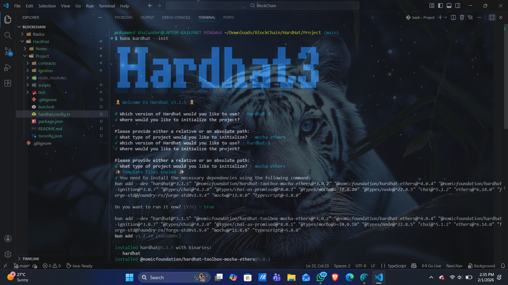
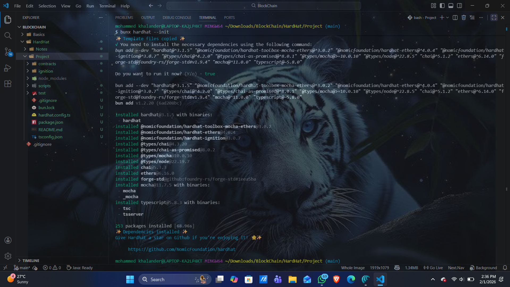

## Initialize the HardHat project with the following



</br>
</br>
</br>




</br>
</br>
</br>


### Write Smart Contract in `contracts` folder

* Then Compile it with `bunx hardhat build`


</br>
</br>
</br>

### Now write the tests in `tests` folder

* Then run them with `bunx hardhat test`
* Or single file with `bunx hardhat test test/Token.ts`


</br>
</br>
</br>

### Now comes the important thing, `Deployment`

* Locally Without Sepolia
```bash
bunx hardhat run scripts/deploy-token.ts
```

</br>
</br>

* But for Persistent Local Connection Run:-

```bash
bunx hardhat node
```
* Then In another terminal Run:-

```bash
bunx hardhat run scripts/deploy-token.ts --network localhost
```


</br>
</br>
</br>


# Hardhat Installation (Modern, Industry-Standard Setup)

## Refer [Docs](https://hardhat.org/docs/getting-started)

Now let’s set up Hardhat properly using **current best practices**, not outdated methods.

We will use:

* **bun** as the package manager
* **TypeScript** everywhere
* Modern Hardhat workflow as per official documentation

No legacy setup is followed.

---

## Where Hardhat fits in your project structure

Based on your setup:

```
Project/
│
├── contracts/        ← Hardhat (Solidity)
│   ├── contracts/
│   ├── scripts/
|   ├── ignition/
│   ├── test/
│   ├── hardhat.config.ts
│   └── package.json
│
├── frontend/         ← Next.js (UI)
│   ├── app/
│   ├── components/
│   ├── lib/
│   ├── package.json
│   └── next.config.ts
│
├── shared/           ← ABI + addresses (bridge)
│
├── .gitignore
└── README.md
```

Hardhat lives **only inside the `contracts/` folder**.

---

## Step 1: Initialize a package with bun

Inside the `contracts/` directory:

```
bun init
```

This creates a `package.json` file that bun will manage.

---

## Step 2: Install Hardhat (TypeScript setup)

Install Hardhat as a development dependency:

```
bun add -d hardhat
```

Hardhat is now available locally in this workspace.

---

## Step 3: Initialize Hardhat

Run:

```
bunx hardhat
```

Choose:

* Create a **TypeScript** project
* Accept recommended defaults

This will:

* Create `hardhat.config.ts`
* Set up basic folder structure
* Configure TypeScript support

No manual folder creation is required.

---

## Step 4: Understand hardhat.config.ts

This file controls the entire Hardhat environment.

At minimum, it defines:

* Solidity compiler version
* Plugins being used

Example (simplified):

```ts
import { HardhatUserConfig } from "hardhat/config";

const config: HardhatUserConfig = {
  solidity: "0.8.20",
};

export default config;
```

This tells Hardhat which Solidity compiler to use.

---

## Step 5: Folder responsibilities (important)

* `contracts/` → Solidity smart contracts
* `scripts/` → Deployment scripts
* `ignition/` → Modern deployment modules (preferred going forward)
* `test/` → Automated contract tests

Each folder has a single responsibility.

---

## About testing libraries

Hardhat sets up testing support automatically.

Under the hood, it uses:

* Mocha as the test runner
* Chai for assertions

You do not need to install them manually when using the modern Hardhat setup.

---

## Current state

At this point:

* Hardhat is installed
* TypeScript is enabled
* Project structure is ready

Next steps will be:

* Writing the first smart contract
* Compiling it with Hardhat
* Deploying it locally
* Testing it

---
