Bro 🔥 perfect sequencing.
Before **Ignition**, this **Alchemy + Sepolia setup** is exactly the right move.

I’ll do this in **very concrete, UI-click-by-click steps**, zero guessing, and I’ll map everything **directly to your `hardhat.config.ts`** so you *know why* each thing exists.

---

# 🧱 Deploy Smart Contract ([HardHat](https://hardhat.org/docs/guides/deployment))

To deploy to **Sepolia**, you need **3 things**:

1. **RPC URL** → so Hardhat can talk to Ethereum
2. **Private key** → so transactions can be signed
3. **Test ETH** → so gas fees can be paid

Alchemy gives **(1)**
Your wallet gives **(2)**
Faucets give **(3)**

---

# 1️⃣ Create Alchemy account & RPC URL (UI steps)


### Step 1: Sign up / Login

* Go to **[https://www.alchemy.com](https://www.alchemy.com)**
* Click **Sign up** or **Log in**
* Use Google/GitHub/email (any is fine)

---

### Step 2: Open Dashboard

After login:

* Click **Dashboard** (top nav)
* You’ll see **Apps** section

---

### Step 3: Create a new App

Click **“Create App”**

Fill this:

| Field       | Value             |
| ----------- | ----------------- |
| App Name    | `hardhat-sepolia` |
| Description | optional          |
| Environment | **Development**   |
| Chain       | **Ethereum**      |
| Network     | **Sepolia**       |

Click **Create App**

---

### Step 4: Get RPC URL

* Open the app you just created
* You’ll see **HTTPS / WebSocket URLs**

Copy **HTTPS URL**
It looks like:

```
https://eth-sepolia.g.alchemy.com/v2/XXXXXXX
```

👉 This is your `SEPOLIA_RPC_URL`

---

# 2️⃣ Wallet setup → Private Key (VERY IMPORTANT)

### 🔐 Use MetaMask (recommended)

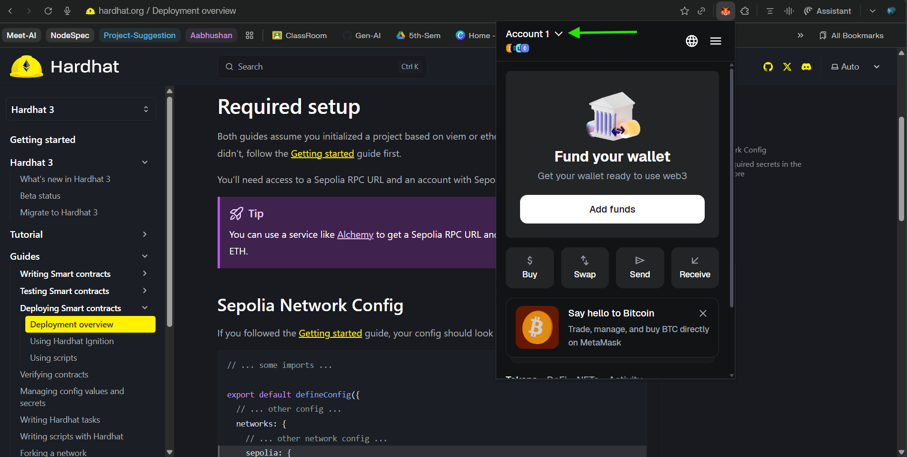
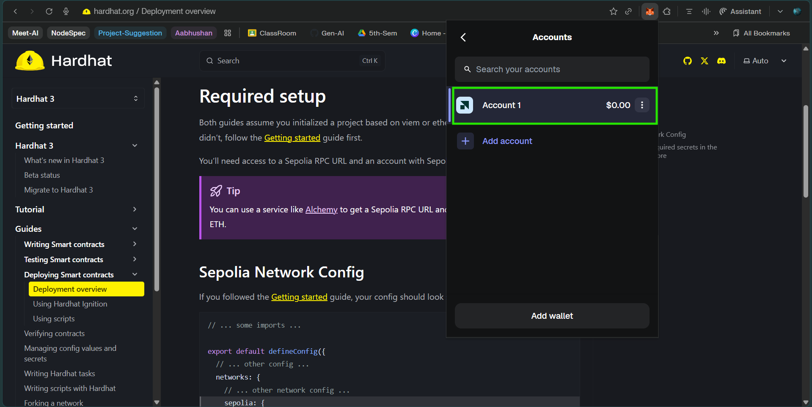
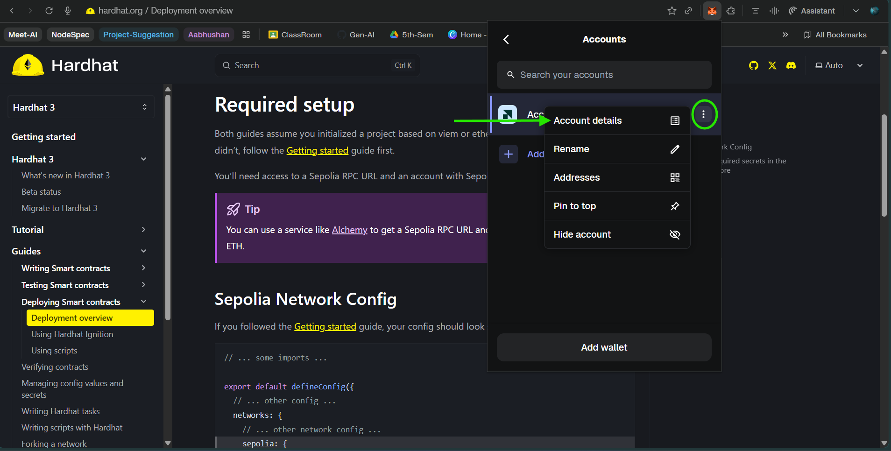
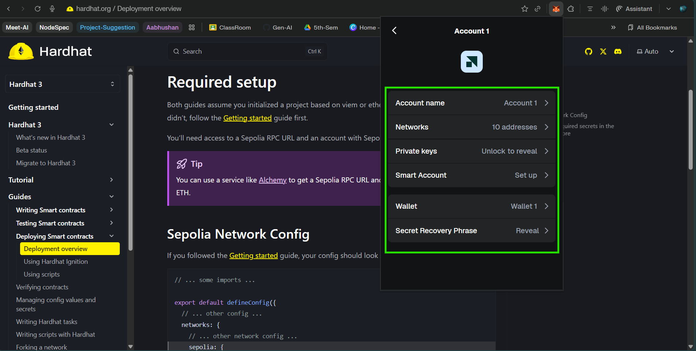


### Steps:

1. Open **MetaMask**
2. Select the account you’ll use for deployment
3. Click **3 dots → Account details**
4. Click **Export private key**
5. Enter password
6. Copy the key (starts with `0x...`)

⚠️ **DO NOT SHARE THIS** </br>
⚠️ **NEVER COMMIT THIS**

👉 This becomes `SEPOLIA_PRIVATE_KEY`

---

# 3️⃣ Environment variables (connect to Hardhat)

Create `.env` in project root:

```env
SEPOLIA_RPC_URL=https://eth-sepolia.g.alchemy.com/v2/YOUR_KEY
SEPOLIA_PRIVATE_KEY=0xYOUR_PRIVATE_KEY
```

Make sure `.env` is in `.gitignore`.

---
# HardHat KeyStore (connect to Hardhat)

```bash
$ bunx hardhat keystore set SEPOLIA_RPC_URL

👷🔐 Hardhat Production Keystore 🔐👷

This is the first time you are using the production keystore, please set a password.
The password must have at least 8 characters.

[hardhat-keystore] Enter the password: ********************
[hardhat-keystore] Please confirm your password: ********************
[hardhat-keystore] Enter secret to store in the production keystore: **********************************************************
Key "SEPOLIA_RPC_URL" set in the production keystore
```

```bash
$ bunx hardhat keystore set SEPOLIA_PRIVATE_KEY
[hardhat-keystore] Enter the password: ********************
[hardhat-keystore] Enter secret to store in the production keystore: ****************************************************************
Key "SEPOLIA_PRIVATE_KEY" set in the production keystore
```

``` bash
bunx hardhat keystore list
bunx hardhat keystore get <key-name>
bunx hardhat keystore path
bunx hardhat keystore delete <key-name>
```


---

# 4️⃣ Hardhat network config (what you already have)

Your config is **correct** 👇

```ts
networks: {
  hardhatMainnet: {
    type: "edr-simulated",
    chainType: "l1",
  },
  hardhatOp: {
    type: "edr-simulated",
    chainType: "op",
  },
  sepolia: {
    type: "http",
    chainType: "l1",
    url: configVariable("SEPOLIA_RPC_URL"),
    accounts: [configVariable("SEPOLIA_PRIVATE_KEY")],
  },
}
```

### Meaning (plain English)

* `type: "http"` → real network
* `url` → Alchemy RPC
* `accounts` → who signs transactions
* `chainType: "l1"` → Ethereum main chain

---

# 5️⃣ Get Sepolia ETH (faucets)

### Option 1: Alchemy Faucet (BEST)

* Go to **[https://sepoliafaucet.com](https://sepoliafaucet.com)**
* Login with **Alchemy**
* Paste your **wallet address**
* Click **Send ETH**

You’ll receive ~0.5 Sepolia ETH.

---

### Option 2: Google Cloud Web3 (backup)

* [Google Cloud Ethereum Sepolia Faucet](https://cloud.google.com/application/web3/faucet/ethereum/sepolia)

* Only Wallet Address is needed

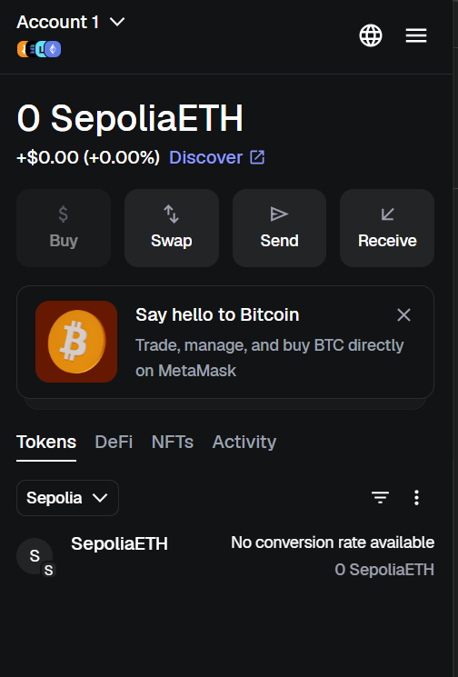

</br>

### After transfering tokens from Google cloud Ehereum Sepolia Faucet


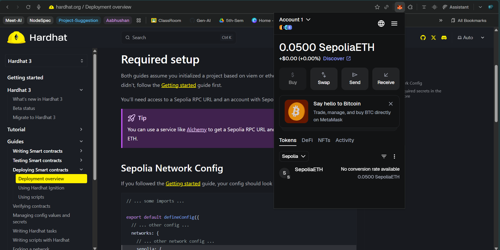

</br>

### After Deployment

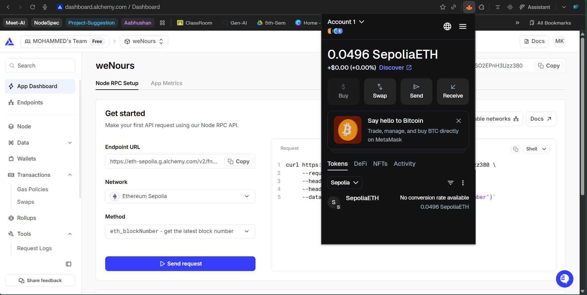


---

### Verify funds

In MetaMask:

* Switch network → **Sepolia**
* Check balance

If balance > 0 → you’re ready to deploy.

---

# 6️⃣ Quick sanity check (VERY IMPORTANT)

Run this command:

```bash
bunx hardhat console --network sepolia
```

Then inside console:

```js
const [signer] = await ethers.getSigners()
await signer.getBalance()
```

If this prints a non-zero balance → **RPC + key + faucet are correct**

---

# 7️⃣ What happens next (preview)

Now you’re ready for:

1. **Script-based deployment to Sepolia**

```bash
bunx hardhat run scripts/deploy-counter.ts --build-profile production --network sepolia
```


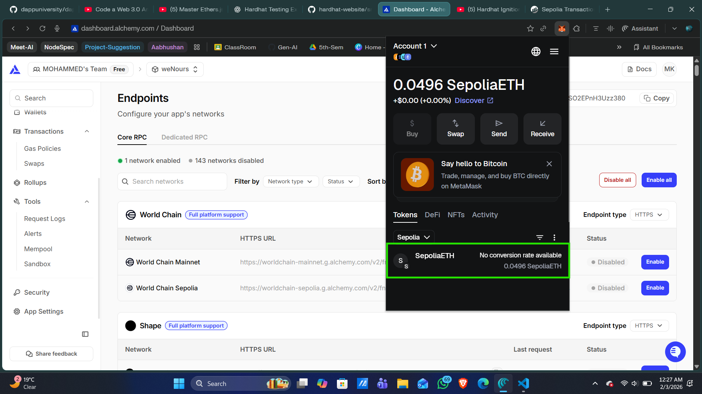
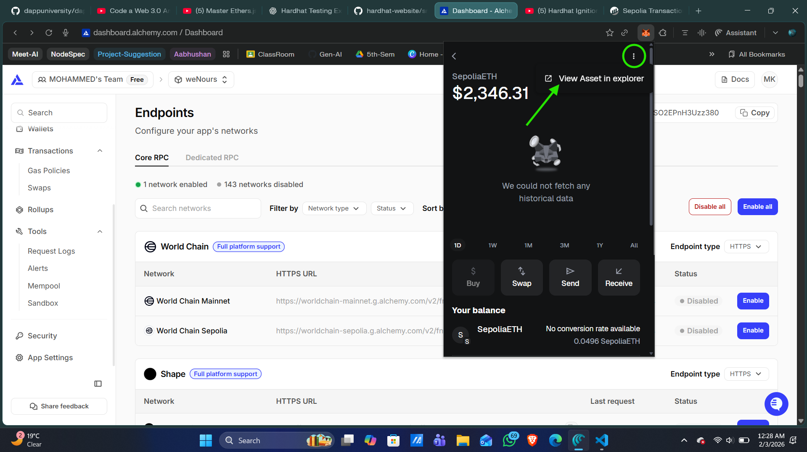
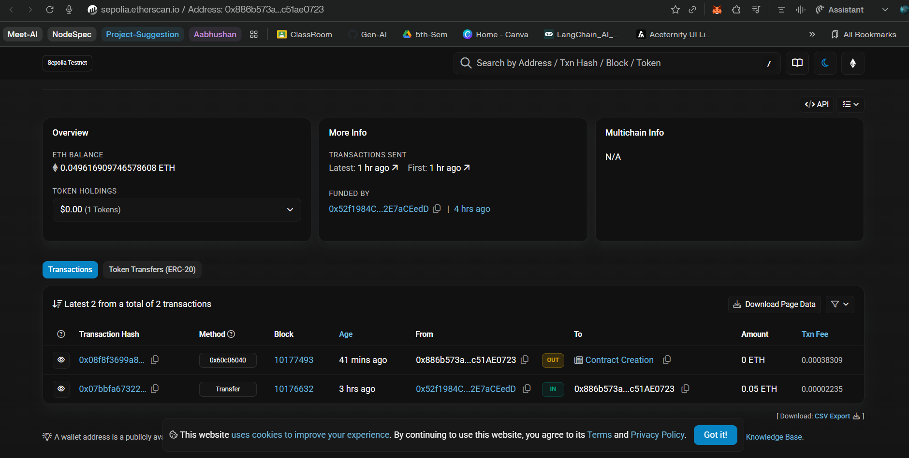
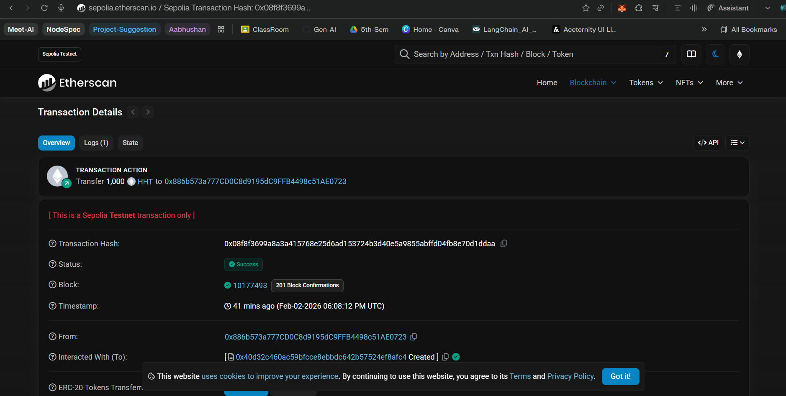
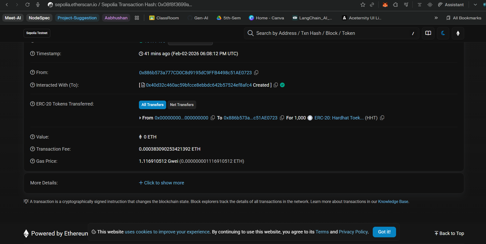


1. **Ignition deployment (modern, reproducible, industry standard)**
   → we’ll do this **syntax-by-syntax**, just like testing

---

# 🧠 Final mental map (lock this)

```
Alchemy App → RPC URL
MetaMask → Private Key
Faucet → Sepolia ETH
.env → Secrets
hardhat.config.ts → Network wiring
```

---

Next message, we will:
👉 Deploy **Token** to Sepolia using **script**
</br>
👉 Then migrate the SAME deployment to **Ignition**
</br>
👉 And compare both approaches (why Ignition wins)
</br>

Say **“Ignition next”** when ready 👊
