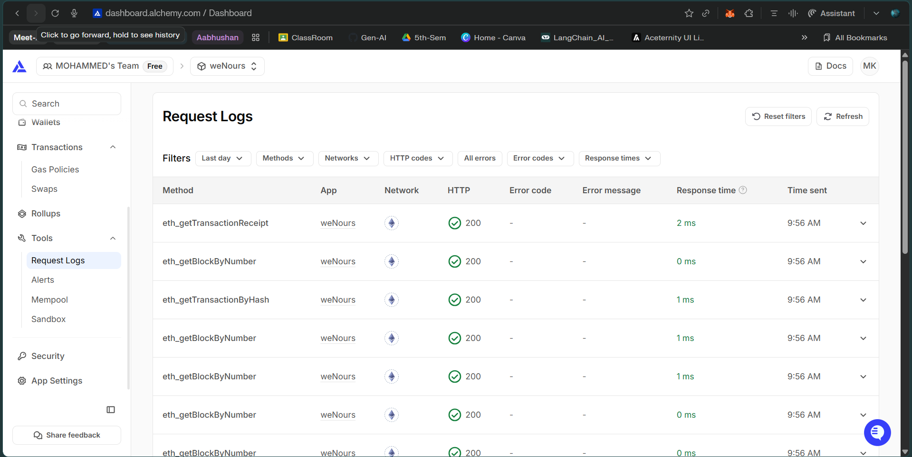

Bro 🔥 congrats first — **you successfully deployed to Sepolia**.
Those Etherscan screenshots you shared are exactly what *should* appear after a correct deployment + mint. So you didn’t do anything wrong.

Now let’s **finish this properly** by:

1. Clearing the confusion: *“Is this all? What else should I do?”*
2. Explaining **Hardhat Ignition** clearly (syntax → meaning → flow)
3. Writing **Ignition deployment for your Token**
4. Running it correctly
5. Understanding **what changes after deployment** (files, Etherscan, re-runs)

No rushing. Same deep explanation style.

---

## 0️⃣ First — answer your immediate doubt

> *“I ran `bunx hardhat run scripts/Token.ts --network sepolia`.
> Is it this much only, or what else I have to do?”*

### ✅ What you did

* You used **script-based deployment**
* You deployed your `Token`
* Constructor ran
* `Transfer(address(0), owner, totalSupply)` event fired
* Etherscan shows:

  * Contract creation ✅
  * ERC-20 transfer (mint) ✅

That is **100% correct** for **script deployment**.

### ❌ But…

This is **NOT Ignition** yet.

Ignition uses:

```bash
bunx hardhat ignition deploy ...
```

Not:

```bash
bunx hardhat run scripts/...
```

So now we *switch gears*.

---

# 1️⃣ What Hardhat Ignition REALLY is (concept first)

### Script deployment (what you already did)

* Imperative (step-by-step)
* You control execution manually
* Rerunning = redeploys everything
* No memory of past deployments

### 🔥 Ignition deployment (industry standard)

* **Declarative**
* You describe *what should exist*
* Ignition figures out:

  * What to deploy
  * What already exists
  * What needs to be executed
* Safe to re-run
* Resumable
* Versioned deployments

> **Think of Ignition like Terraform for smart contracts**

---

# 2️⃣ Core idea of Ignition (1 sentence)

> **“Declare desired blockchain state, not deployment steps.”**

---

# 3️⃣ Folder structure (important)

Ignition ALWAYS lives here:

```
ignition/
└── modules/
    └── Token.ts
```

Not in `scripts/`.

---

# 4️⃣ Understanding the official Counter example (line by line)

```ts
import { buildModule } from "@nomicfoundation/hardhat-ignition/modules";
```

* `buildModule` = factory to define a deployment module

---

```ts
export default buildModule("CounterModule", (m) => {
```

* `"CounterModule"` → logical name
* `m` → **module builder object**

  * Used to declare contracts & calls

---

```ts
const counter = m.contract("Counter");
```

Meaning:

* Deploy contract named `"Counter"`
* Uses constructor args if provided
* Ignition tracks this deployment

---

```ts
m.call(counter, "incBy", [5n]);
```

Meaning:

* After deployment
* Call `incBy(5)`
* This is a **transaction**
* Ignition tracks this too

---

```ts
return { counter };
```

* Exports deployed instances
* Useful for composition with other modules

---

⚠️ Important:

> **Nothing runs here.**
> This file only *declares intent*.

---

# 5️⃣ Writing Ignition module for YOUR Token

Now let’s do **your Token**, step by step.

---

## 📁 `ignition/modules/Token.ts`

```ts
import { buildModule } from "@nomicfoundation/hardhat-ignition/modules";

export default buildModule("TokenModule", (m) => {
  // Constructor argument
  const totalSupply = 1000n;

  // Declare Token deployment
  const token = m.contract("Token", [totalSupply]);

  // (Optional) future calls go here
  // m.call(token, "transfer", [someAddress, 100n]);

  return { token };
});
```

### Meaning (very important)

* `m.contract("Token", [totalSupply])`

  * Deploys Token
  * Calls constructor
  * Emits mint Transfer event
* Ignition stores:

  * Address
  * Tx hash
  * Network
  * Block number

---

# 6️⃣ Running Ignition LOCALLY (simulation)

Before Sepolia, always test locally:

```bash
bunx hardhat ignition deploy ignition/modules/Token.ts
```

What happens:

* Uses **simulated network**
* Instant execution
* Validates module logic

---

# 7️⃣ Running Ignition on Sepolia (REAL deployment)

Now the real command 👇

```bash
bunx hardhat ignition deploy ignition/modules/Token.ts --network sepolia
```

What you’ll see:

* Prompt for confirmation
* Deployment progress
* Tx hashes
* Final deployed address

---

# 8️⃣ What Ignition creates after deployment (VERY IMPORTANT)

After running on Sepolia, a new folder appears:

```
ignition/
└── deployments/
    └── chain-11155111/
        └── TokenModule/
            ├── deployment.json
            ├── Token.json
            └── ...
```

### This is GOLD 🥇

It contains:

* Contract address
* Constructor args
* Tx hashes
* ABI references

👉 **This is why Ignition is reproducible**

You should **commit this folder to git**.

---

# 9️⃣ What happens if you run the SAME command again?

```bash
bunx hardhat ignition deploy ignition/modules/Token.ts --network sepolia
```

### Result:

* ❌ No redeployment
* ✅ Ignition detects existing Token
* ✅ Skips deployment
* ✅ Zero gas wasted

This is the killer feature.

---

# 🔁 Modifying the module (real power)

Example: add a transfer after deployment

```ts
export default buildModule("TokenModule", (m) => {
  const totalSupply = 1000n;
  const token = m.contract("Token", [totalSupply]);

  const recipient = "0x1234...abcd";
  m.call(token, "transfer", [recipient, 100n]);

  return { token };
});
```

Re-run:

```bash
bunx hardhat ignition deploy ignition/modules/Token.ts --network sepolia
```

Ignition will:

* NOT redeploy Token
* ONLY execute `transfer`

---

# 🔍 Connecting this to your Etherscan screenshots

What you saw on Etherscan:

* Contract creation tx
* ERC-20 Transfer from `0x0` → owner
* Gas usage
* Confirmations

That’s:

* Constructor execution
* Mint event
* Exactly what Ignition will also do

Ignition just **manages and remembers it**.

---

# 🔚 Final mental map (lock this in)

```
scripts/        → quick & manual
ignition/       → professional & reproducible

hardhat run     → imperative
hardhat ignition → declarative

Etherscan       → verification & inspection
ignition/deployments → source of truth
```

---

## What’s NEXT (natural progression)

1. 🔍 **Verify contract on Etherscan**
2. 🧱 Compose multiple Ignition modules
3. 🔄 Upgrade / extend deployments
4. 🔐 Production-grade workflows

If you want, next we can:

* Verify Token on Etherscan step-by-step
* Add transfer calls via Ignition
* Compare Ignition vs scripts side-by-side

Just say the word, bro 👊


---


</br>
</br>
</br>
</br>
</br>
</br>
</br>
</br>
</br>
</br>
</br>


---


1. **Why your script-style access doesn’t exist in Ignition**
2. **How Ignition replaces `ethers.getSigners()`, `getAddress()`, logs, etc**
3. **Where deployment info actually lives in Ignition**
4. **About `--build-profile production`**
5. **How to get owner / random address / balances with Ignition**
6. **The correct mental model (this is the key)**

---

## 1️⃣ First: WHY your script-style code doesn’t translate 1-to-1

In scripts, you are doing this:

```ts
const token = await ethers.deployContract("Token", [TOTAL_SUPPLY]);
const address = await token.getAddress();
const [owner] = await ethers.getSigners();
```

This works because:

* Scripts are **imperative**
* You control **runtime**
* You can `console.log` anything
* You are executing JavaScript step-by-step

---

### ❌ Ignition is NOT like that

Ignition modules:

* ❌ do NOT run like scripts
* ❌ do NOT give you live JS objects
* ❌ do NOT allow `await`, `console.log`, or runtime inspection

👉 Ignition is **declarative**, not imperative.

> You **describe** what should exist
> Ignition **executes & records it**

This is the biggest mental shift.

---

## 2️⃣ How Ignition replaces `ethers.getSigners()`

### In scripts

```ts
const [owner] = await ethers.getSigners();
```

### In Ignition

You **declare accounts**, you don’t fetch them.

```ts
export default buildModule("TokenModule", (m) => {
  const deployer = m.getAccount(0); // first signer
});
```

### What this means

* `m.getAccount(0)` → deployer / owner
* `m.getAccount(1)` → second account
* Deterministic
* Network-aware

📌 This is how Ignition controls **who sends transactions**.

---

## 3️⃣ How Ignition replaces `token.getAddress()`

In scripts:

```ts
const address = await token.getAddress();
```

In Ignition:

```ts
const token = m.contract("Token", [TOTAL_SUPPLY]);
```

You **don’t fetch the address at runtime**.

Instead:

👉 Ignition stores it in files.

After deployment, you’ll find:

```
ignition/deployments/chain-11155111/TokenModule/Token.json
```

Inside:

```json
{
  "address": "0x40d32c460ac59bfcee8ebbdc642b57524ef8afc4",
  "abi": [...]
}
```

📌 This is the **source of truth**, not console logs.

---

## 4️⃣ How to “verify initial state” in Ignition

This is where thinking must change.

### ❌ This does NOT exist in Ignition

```ts
const ownerBalance = await token.balanceOf(owner.address);
console.log(ownerBalance);
```

Why?

Because:

* Ignition modules do NOT execute reads
* Reads don’t affect deployment
* Ignition tracks **transactions only**

---

### ✅ Correct Ignition approach

You verify state using:

1. **Tests**
2. **Hardhat console**
3. **Etherscan**
4. **Post-deployment scripts**

Ignition’s job ends at:

> “Contracts deployed and transactions executed”

---

## 5️⃣ How to call functions in Ignition (instead of JS calls)

In scripts:

```ts
await token.transfer(user.address, 100n);
```

In Ignition:

```ts
const user = m.getAccount(1);

m.call(token, "transfer", [user, 100n]);
```

### Important

* `m.call()` = declare a transaction
* No return values
* No console output
* Ignition records execution

---

## 6️⃣ Full Ignition module for your Token (correct & clean)

```ts
// ignition/modules/Token.ts
import { buildModule } from "@nomicfoundation/hardhat-ignition/modules";

export default buildModule("TokenModule", (m) => {
  const TOTAL_SUPPLY = 1000n;

  // Accounts
  const owner = m.getAccount(0);
  const user1 = m.getAccount(1);

  // Deploy Token (owner = msg.sender)
  const token = m.contract("Token", [TOTAL_SUPPLY], {
    from: owner,
  });

  // Optional post-deploy action
  // m.call(token, "transfer", [user1, 100n]);

  return { token };
});
```

---

## 7️⃣ Where is the “output” in Ignition?

After deployment:

```
ignition/deployments/
└── chain-11155111/
    └── TokenModule/
        ├── deployment.json
        ├── Token.json
```

You inspect:

* Address
* Tx hashes
* Constructor args
* Deployer

👉 **This replaces all console.log usage**

---

## 8️⃣ About `--build-profile production`

### 🔥 Important clarification

For Ignition:

```bash
hardhat ignition deploy ...
```

Hardhat **automatically uses the `production` build profile**.

From the docs:

> “Before running any deployment, Ignition will build your contracts using the production build profile.”

✅ So you **DO NOT** need:

```bash
--build-profile production
```

That flag is mainly for:

* `hardhat run`
* custom scripts

---

## 9️⃣ How to inspect balances / owner AFTER Ignition deployment

### Option 1: Hardhat console (best)

```bash
bunx hardhat console --network sepolia
```

```js
const token = await ethers.getContractAt(
  "Token",
  "0x40d32c460ac59bfcee8ebbdc642b57524ef8afc4"
);

const [owner] = await ethers.getSigners();
await token.balanceOf(owner.address);
```

---

### Option 2: Etherscan

You already did this 👌
That ERC-20 mint transfer is your proof.

---

## 🔑 Final mental shift (MOST IMPORTANT)

### Scripts:

> “Deploy → inspect → log → verify”

### Ignition:

> “Declare → deploy → record → inspect externally”

Ignition is **not interactive**.
It is **reproducible**.

---

## 🧠 One-line summary

* `ethers.getSigners()` → `m.getAccount(index)`
* `token.getAddress()` → `Token.json` in `ignition/deployments`
* `console.log()` → inspect deployment artifacts
* State verification → tests / console / Etherscan
* `--build-profile production` → automatic in Ignition

---


### Deployment Logs in Alchemy

